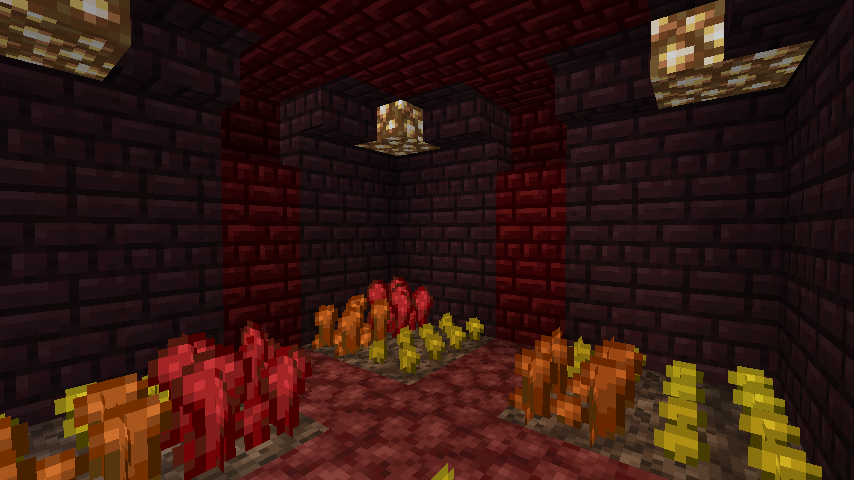

  

# Accessible Nether Wart

> A Minecraft resource pack that helps differentiating between the different growth stages of Nether Wart

## Installation

Download a zip file of this repository by clicking on the green Clone or download button at the right. You have to unzip the zip file and place the resulting folder into the `resourcepacks` folder of your Minecraft installation.

## License

The data pack is licensed under the `Attribution-NonCommercial-NoDerivatives 4.0 International`. For more information, take a look at the license file within this repository.
